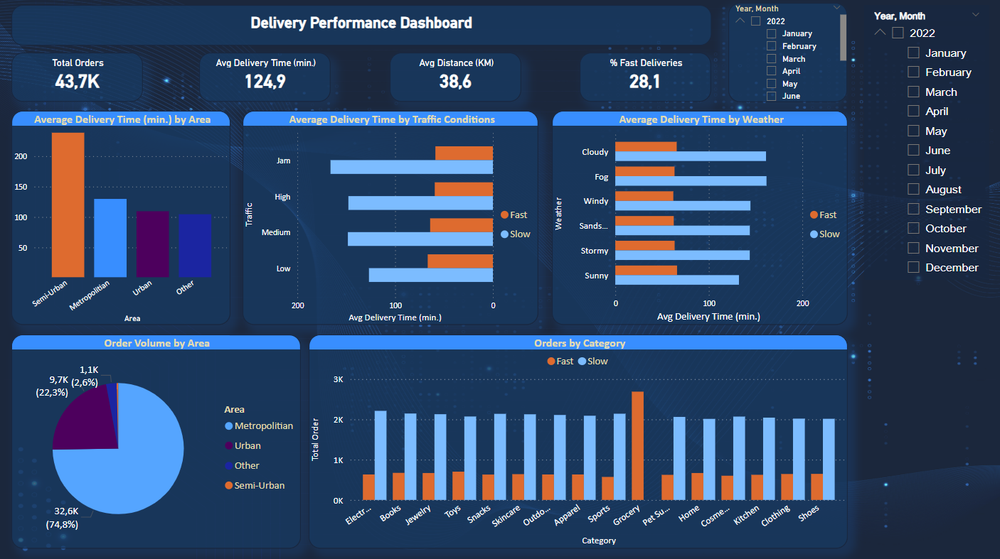

# 📦 Delivery Dataset Analysis

This project analyzes a last-mile delivery dataset using Python (Jupyter Notebook) and visualizes insights through an interactive Power BI dashboard. The goal is to uncover patterns and key metrics related to delivery performance, such as average delivery time, order volume by area, and the impact of traffic and weather conditions.

## Project Overview

### Objectives
- Analyze delivery time performance by area, traffic, and weather.
- Visualize fast vs. slow deliveries across product categories.
- Identify trends to help optimize logistics strategies.

### Tools & Technologies
- Python (Pandas, Matplotlib, Seaborn)
- Jupyter Notebook
- Power BI
- CSV for data input

---

## Files Included

| File Name                         | Description                                     |
|----------------------------------|-------------------------------------------------|
| `delivery_data_analysis.ipynb`   | Jupyter Notebook for data cleaning & analysis   |
| `delivery_dataset.csv`           | Dataset used for Power BI dashboard             |
| `powerbi_dashboard_delivery.png` | Screenshot of the final Power BI dashboard      |

---

## 📈 Power BI Dashboard Highlights

The dashboard presents:
- **Total Orders**: 43.7K
- **Average Delivery Time**: 124.9 minutes
- **Average Distance**: 38.6 km
- **Fast Deliveries Percentage**: 28.1%

### Key Visualizations
- **Average Delivery Time by Area**  
- **Delivery Time vs. Traffic & Weather Conditions**  
- **Order Volume by Area**  
- **Orders by Category (Fast vs. Slow)**  

---

## Author
Cansu Beyaz
